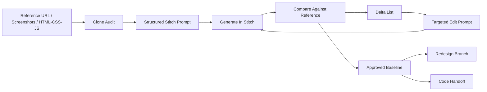

[](https://github.com/404kidwiz/super-stitch-skill/actions/workflows/validate.yml)

# Super Stitch Skill

`super-stitch-skill` is the repo-ready, reusable version of the Stitch design system we just built locally.

It packages a high-fidelity Google Stitch workflow for:
- premium UI prompt writing
- exact or near-exact website recreation from live URLs, screenshots, or HTML/CSS/JS
- compare-and-refine clone loops until the output matches the reference
- redesigns that start from a faithful baseline instead of a vague restart
- implementation handoff into Tailwind v4, shadcn/ui, Radix, and React

This repo keeps `super-stitch-skill` as the canonical package name and retains `google-stitch-design` as a compatibility alias for older prompts, installers, and local links.

## Visual Flow



## What The Skill Does

At a high level, the skill turns Stitch into a real design studio workflow instead of a one-shot mockup prompt.

It helps an agent:
- choose a clear visual direction before generating anything
- define layout, hierarchy, buttons, spacing, forms, and responsive behavior up front
- use Stitch for multi-screen flows and prototypes instead of isolated hero shots
- clone a live site or screenshot by running a disciplined fidelity loop
- hand approved designs off into production-friendly frontend primitives

## Core Capabilities

### 1. Premium Stitch Prompting

The skill builds structured prompts that explicitly define:
- audience
- page or product purpose
- layout pattern
- visual direction
- CTA hierarchy
- responsive behavior
- interaction emphasis

This avoids the usual low-signal prompts like "make a modern landing page."

### 2. Reference Site Cloning

The skill supports recreating sites from:
- live URLs
- screenshots
- HTML/CSS/JS references

It uses a fixed loop:

1. capture
2. inspect
3. extract
4. prompt
5. generate
6. compare
7. edit
8. repeat

That loop is codified in:
- [site-clone-loop.md](/Users/404kidwiz/Documents/New%20project/.codex/skills/super-stitch-skill/references/site-clone-loop.md)

### 3. Redesign After Fidelity

Once the clone is close enough, the skill can branch into redesign without losing the original structure.

Typical redesign paths:
- modernize while preserving layout
- convert to dark mode
- elevate into a premium cinematic version
- simplify and improve accessibility
- translate directly into shadcn/ui and Tailwind implementation

### 4. Design-System Continuity

The skill is meant to work with `.stitch/DESIGN.md` so a project can keep a coherent design language across generations, edits, and handoff.

### 5. Code Handoff

The handoff guidance maps Stitch outcomes into:
- Tailwind CSS v4
- shadcn/ui
- Radix UI
- Lucide
- Framer Motion

That guidance lives in:
- [component-handoff.md](/Users/404kidwiz/Documents/New%20project/.codex/skills/super-stitch-skill/references/component-handoff.md)

## Skill Structure

Canonical skill:
- [super-stitch-skill/SKILL.md](/Users/404kidwiz/Documents/New%20project/.codex/skills/super-stitch-skill/SKILL.md)

Compatibility alias:
- [google-stitch-design/SKILL.md](/Users/404kidwiz/Documents/New%20project/.codex/skills/google-stitch-design/SKILL.md)

Reference files:
- [stitch-studio.md](/Users/404kidwiz/Documents/New%20project/.codex/skills/super-stitch-skill/references/stitch-studio.md)
- [premium-ui-system.md](/Users/404kidwiz/Documents/New%20project/.codex/skills/super-stitch-skill/references/premium-ui-system.md)
- [site-clone-loop.md](/Users/404kidwiz/Documents/New%20project/.codex/skills/super-stitch-skill/references/site-clone-loop.md)
- [component-handoff.md](/Users/404kidwiz/Documents/New%20project/.codex/skills/super-stitch-skill/references/component-handoff.md)
- [prompt-template.md](/Users/404kidwiz/Documents/New%20project/.codex/skills/super-stitch-skill/references/prompt-template.md)

Install and verification scripts:
- [install-super-stitch-skill.sh](/Users/404kidwiz/Documents/New%20project/scripts/install-super-stitch-skill.sh)
- [verify-super-stitch-skill.sh](/Users/404kidwiz/Documents/New%20project/scripts/verify-super-stitch-skill.sh)
- [validate-repo.sh](/Users/404kidwiz/Documents/New%20project/scripts/validate-repo.sh)

Legacy compatibility scripts:
- [install-google-stitch-design.sh](/Users/404kidwiz/Documents/New%20project/scripts/install-google-stitch-design.sh)
- [verify-google-stitch-design.sh](/Users/404kidwiz/Documents/New%20project/scripts/verify-google-stitch-design.sh)

Examples:
- [examples/README.md](/Users/404kidwiz/Documents/New%20project/examples/README.md)
- [examples/clone-reference.md](/Users/404kidwiz/Documents/New%20project/examples/clone-reference.md)
- [examples/redesign-after-clone.md](/Users/404kidwiz/Documents/New%20project/examples/redesign-after-clone.md)
- [examples/code-handoff.md](/Users/404kidwiz/Documents/New%20project/examples/code-handoff.md)

## How To Install

Run:

```bash
bash scripts/install-super-stitch-skill.sh
```

What this does:
- installs the canonical `super-stitch-skill`
- links it through Gemini's official `skills link` flow when Gemini is available
- installs the legacy `google-stitch-design` alias too when that folder exists
- places both under the shared skills root used by your local CLIs

Shared root:
- `~/.gemini/antigravity/skills`

On this machine, the following tool-specific skill directories point at that shared root:
- `~/.gemini/skills`
- `~/.claude/skills`
- `~/.codex/skills`
- `~/.config/opencode/skills`

## How To Verify

Run:

```bash
bash scripts/verify-super-stitch-skill.sh
```

For repo-only validation with no CLI smoke tests or network dependencies:

```bash
bash scripts/validate-repo.sh
```

The verifier checks:
- the repo-local skill exists
- the canonical skill is visible in Gemini, Claude, Codex, and OpenCode
- Gemini reports the skill as enabled
- all four CLIs can answer a smoke-test question that depends on the actual skill contents

Smoke-test target:
- the third item under `Read In This Order`
- expected answer: `references/site-clone-loop.md`

## CI

This repo includes:
- [validate.yml](/Users/404kidwiz/Documents/New%20project/.github/workflows/validate.yml)

The workflow runs on pushes to `main` and on pull requests. It only performs local, non-network validation:
- shell syntax checks for the install and verify scripts
- required file presence checks
- README structure checks
- canonical skill metadata checks

## Example Uses

### Clone A Site In Stitch

```text
Use super-stitch-skill to recreate this site as closely as possible from the provided URL and screenshots, then give me the first-pass Stitch clone prompt plus a delta checklist.
```

### Redesign From A Faithful Clone

```text
Use super-stitch-skill to clone this landing page first, then branch into a darker premium cinematic redesign while keeping the same overall information architecture.
```

### Generate A New Product UI

```text
Use super-stitch-skill to design a responsive AI workspace for founders with desktop-first priority, a dark tech visual direction, clear CTA hierarchy, and implementation-ready component choices.
```

### Move From Stitch To Code

```text
Use super-stitch-skill to turn the approved Stitch screen into a clean Tailwind v4 + shadcn/ui component plan with button variants, nav behavior, loading states, and motion guidance.
```

For copy-paste-ready prompt files, use:
- [examples/clone-reference.md](/Users/404kidwiz/Documents/New%20project/examples/clone-reference.md)
- [examples/redesign-after-clone.md](/Users/404kidwiz/Documents/New%20project/examples/redesign-after-clone.md)
- [examples/code-handoff.md](/Users/404kidwiz/Documents/New%20project/examples/code-handoff.md)

## Design Standard

This repo is opinionated. The quality bar is intentionally high.

The skill rejects:
- generic AI layouts
- vague "modern SaaS" prompts
- dead hero sections
- unspecified button states
- weak hierarchy
- clone attempts without a reference audit
- redesigns that ignore what made the original reference work

The expected output should feel:
- intentional
- premium
- implementation-ready
- responsive
- accessible
- faithful when cloning

## Notes

- This repo keeps the README at the root on purpose. The skill itself stays lean and self-contained.
- `super-stitch-skill` is the name to publish and share going forward.
- `google-stitch-design` remains here so old prompts and existing local installs do not break.
- The repo is public and includes GitHub issues plus a basic validation workflow.
